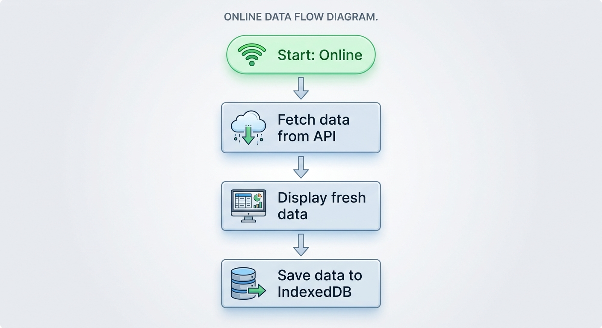
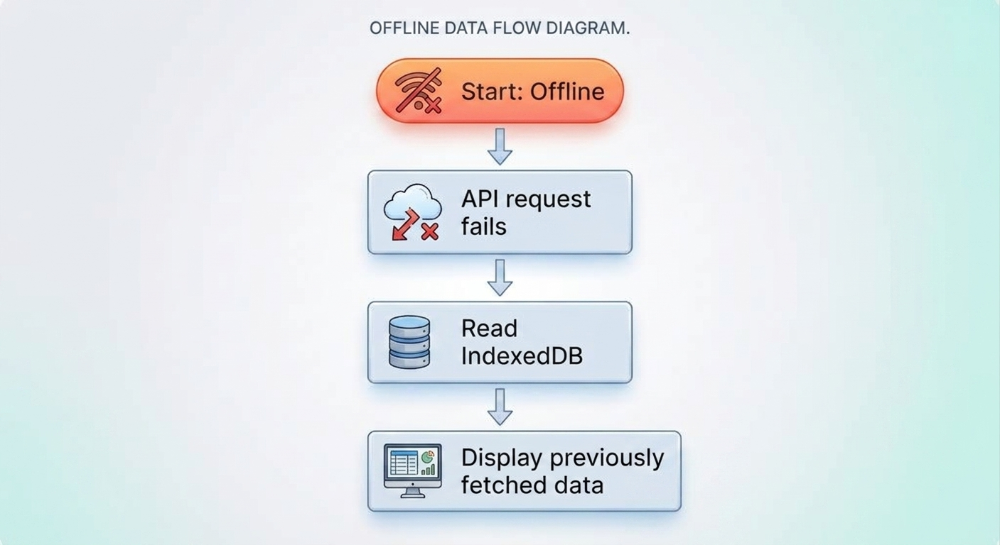
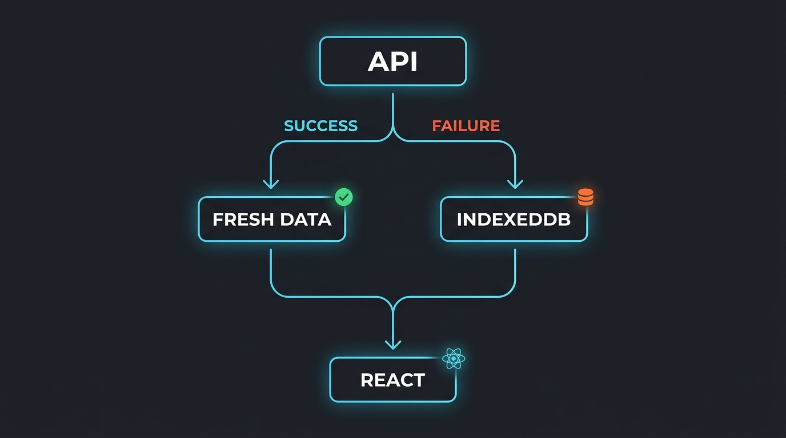
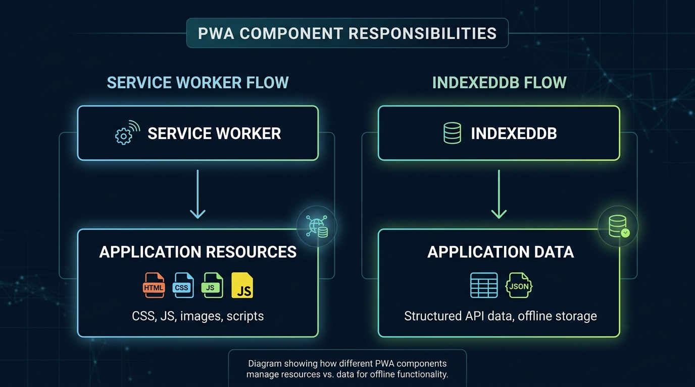

---

## What happens when a dashboard loses its internet connection?

For many web applications, the answer is simple: the API request fails and the user sees an empty screen or an error message.

But dashboards often don't need to behave this way.

If the user has already loaded the data once, we can store that data locally and continue displaying it when the network is unavailable.

In this post, we'll build a small **offline-first React PWA** using Vite, TypeScript, a Service Worker, and IndexedDB.

> **Source code:** [GitHub – offline-first-react-pwa](https://github.com/SarathAdhi/offline-first-react-pwa)

## What we're building

The application follows a simple strategy:



When the user goes offline:



This doesn't make the API magically available offline. Instead, it gives the user access to the **last successfully fetched data**.

## Why a PWA?

A Progressive Web App adds capabilities that make a web application behave more like an installed application.

For an offline-first dashboard, the important pieces are:

- **Service Worker** — handles network and resource caching.
- **IndexedDB** — stores structured application data locally.
- **Web App Manifest** — provides installation metadata.

We're implementing these pieces manually instead of using `vite-plugin-pwa`.

## Project setup

Create a React + TypeScript application with Vite:

```bash
npm create vite@latest dashboard-pwa -- --template react-ts
cd dashboard-pwa
npm install
```

The project can then be organized around three main pieces:

```text
src/
├── api.ts
├── db.ts
├── App.tsx
└── main.tsx

public/
├── manifest.json
└── sw.js
```

## Fetching API data

The API layer is responsible for retrieving fresh data.

```ts
export interface Post {
  userId: number;
  id: number;
  title: string;
  body: string;
}

export async function fetchPosts(): Promise<Post[]> {
  const response = await fetch("https://jsonplaceholder.typicode.com/posts");

  if (!response.ok) {
    throw new Error("Failed to fetch posts");
  }

  return response.json();
}
```

In a real dashboard, this would point to your own backend API.

## Storing data with IndexedDB

Instead of relying only on the network, we save successful API responses locally.

```ts
export async function savePosts(posts: Post[]): Promise<void> {
  // Store posts in IndexedDB
}
```

And when the network isn't available:

```ts
export async function getCachedPosts(): Promise<Post[]> {
  // Read posts from IndexedDB
}
```

IndexedDB is a better fit than `localStorage` when working with structured or larger datasets.

## Connecting everything in React

The core logic is surprisingly simple:

```tsx
try {
  const freshPosts = await fetchPosts();

  setPosts(freshPosts);
  await savePosts(freshPosts);
} catch {
  const cachedPosts = await getCachedPosts();

  setPosts(cachedPosts);
}
```

The important idea is:



When online, the application always tries to get fresh data.

When that fails, it falls back to the most recently cached data.

## Adding the Service Worker

The Service Worker handles application resources and network requests.

A basic implementation can use a network-first strategy:

```js
self.addEventListener("fetch", (event) => {
  event.respondWith(
    fetch(event.request)
      .then((response) => {
        return response;
      })
      .catch(() => {
        return caches.match(event.request);
      }),
  );
});
```

The Service Worker and IndexedDB have different responsibilities:



Keeping those responsibilities separate makes the architecture easier to reason about.

## Adding the PWA manifest

The manifest describes how the application should behave when installed:

```json
{
  "name": "Offline Dashboard",
  "short_name": "Dashboard",
  "start_url": "/",
  "display": "standalone",
  "theme_color": "#111827"
}
```

Then reference it from `index.html`:

```html
<link rel="manifest" href="/manifest.json" />
```

Now the browser has the information needed to treat the application as an installable web application.

## Testing offline mode

Build and preview the application:

```bash
npm run build
npm run preview
```

Then open your browser's DevTools.

Under **Application**, you can inspect:

```text
Service Workers
Cache Storage
IndexedDB
Manifest
```

To test the offline behavior:

1. Load the application while online.
2. Let the API data load.
3. Open DevTools → Network.
4. Enable **Offline**.
5. Reload the application.

The API request should fail, but the application should retrieve the previously stored data from IndexedDB.

That's the main behavior we're looking for.

## Taking it further

The simple implementation uses a network-first approach, but production applications can go further.

A dashboard could use **stale-while-revalidate**:

```text
Cached data
    ↓
Show immediately
    ↓
Fetch fresh data in background
    ↓
Update UI
    ↓
Update IndexedDB
```

This gives users an almost instant dashboard while still keeping the data fresh whenever the network is available.

You can also add:

- Last-updated timestamps
- Offline indicators
- Background synchronization
- Offline mutation queues
- Conflict resolution
- User-specific cache management

For sensitive applications, it's also important to carefully consider which data should be persisted locally.

## Final architecture

The complete idea is quite small:

```text
                 React
                   │
                   ▼
                API Call
                   │
             ┌─────┴─────┐
             │           │
          Online       Offline
             │           │
             ▼           ▼
        Fresh Data   IndexedDB
             │           │
             └─────┬─────┘
                   ▼
                Dashboard
```

A PWA doesn't require rebuilding your application from scratch.

You can take an existing React application and progressively add offline support by combining a Service Worker with local data persistence.

For dashboards and business applications where users may experience unreliable connectivity, this small architectural change can make the application feel significantly more reliable.

## Source Code

The complete example is available here:

**[GitHub – SarathAdhi/offline-first-react-pwa](https://github.com/SarathAdhi/offline-first-react-pwa)**

The repository contains the React + TypeScript + Vite implementation used for this example.
